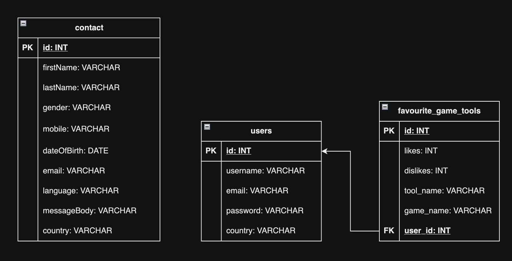
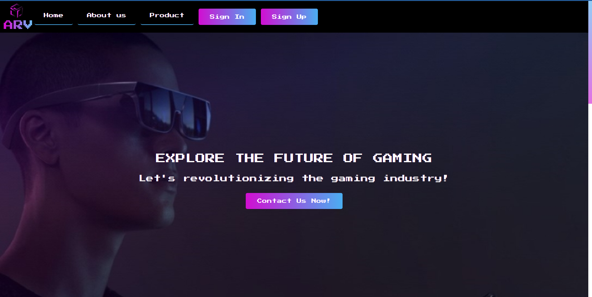
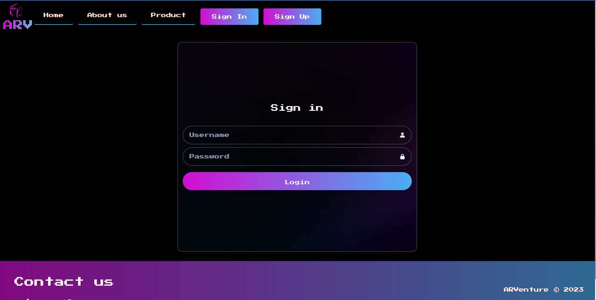
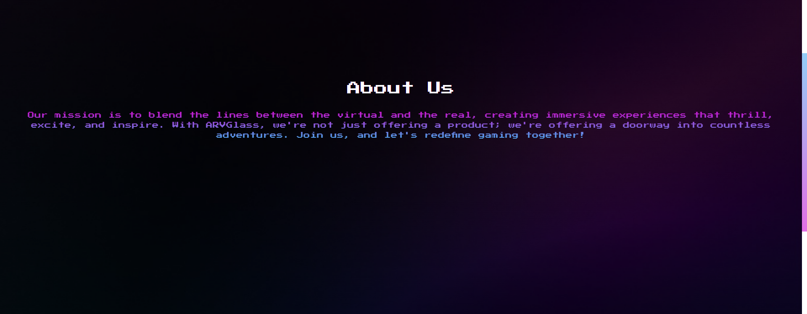
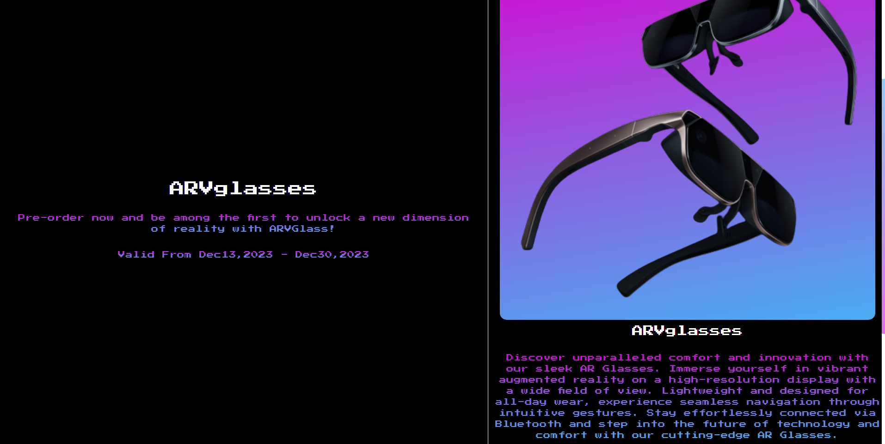

# ARVenture Execution Design Phase

## Table of contents

- [ARVenture Execution Design Phase](#arventure-execution-design-phase)
  - [Table of contents](#table-of-contents)
  - [System Architecture (Client-Server Mostly)](#system-architecture-client-server-mostly)
  - [Database Design](#database-design)
  - [ARVenture Web UI/UX Design](#arventure-web-uiux-design)
    - [Figma Design](#figma-design)
    - [UI/UX Principles](#uiux-principles)
      - [Atomic Design](#atomic-design)
      - [Prototype View](#prototype-view)
      - [Editor View](#editor-view)
    - [Home Page](#home-page)
    - [Login Page](#login-page)
    - [Signup Page](#signup-page)
    - [About Us Page](#about-us-page)
    - [Product Page Page](#product-page-page)
    - [ARVote Create Page](#arvote-create-page)
    - [ARVote Search Page](#arvote-search-page)
  - [ARVenture Mobile UI/UX Design](#arventure-mobile-uiux-design)

## System Architecture (Client-Server Mostly)

## Database Design

## ARVenture Web UI/UX Design

### Figma Design

### UI/UX Principles
In crafting this design, we adhered to the fundamental principles of Consistency, Hierarchy, and Contrast. These principles guided our decisions regarding color usage, component selection, and overall layout, ensuring a cohesive and user-friendly experience.

#### Atomic Design
We used the atomic design approach by building the pages by bottom up. This methodology gained inspiration from the world of natural science—Atoms are the basic building blocks of all matter meaning that two or more atoms combine to form molecules. Rather than designing collections of web pages, atomic design begins with the basic UI components known as atoms (buttons, menu items, etc.) and gradually builds the entire UI.

#### Prototype View

You Can view a prototype and test the design from this [Link](https://www.figma.com/proto/ckDjkDlhqG1SmVbtP9ojqx/ARVenture-Design?type=design&node-id=0-1&t=F4oQoAANsBOavpSb-0&scaling=scale-down&page-id=0%3A1&starting-point-node-id=323%3A1698&show-proto-sidebar=1)

#### Editor View

You Can Edit the design from this [Link](https://www.figma.com/file/ckDjkDlhqG1SmVbtP9ojqx/ARVenture-Design?type=design&node-id=0-1&mode=design&t=F4oQoAANsBOavpSb-0)

### Home Page

### Login Page

### Signup Page

### About Us Page

### Product Page Page

### ARVote Create Page

### ARVote Search Page

## ARVenture Mobile UI/UX Design
