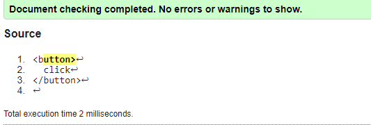
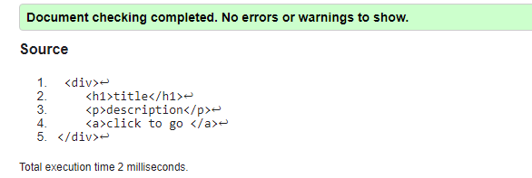
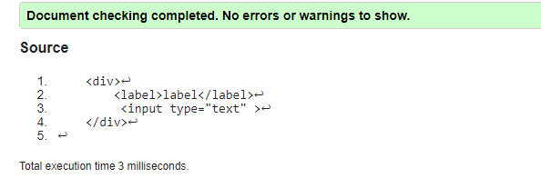
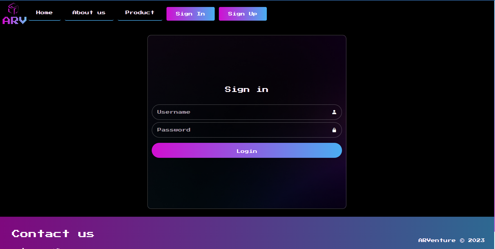
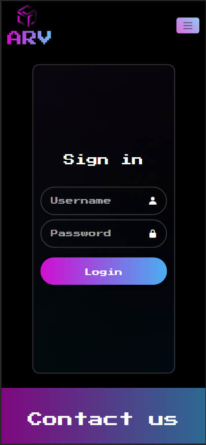
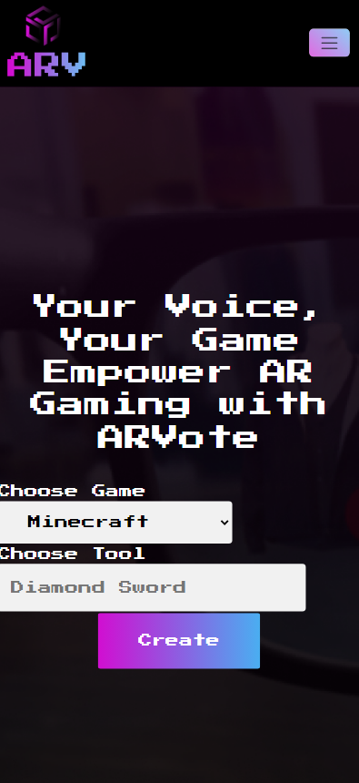
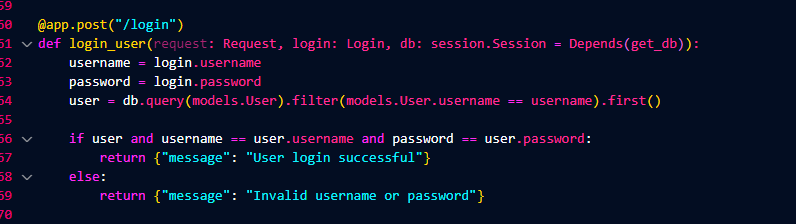
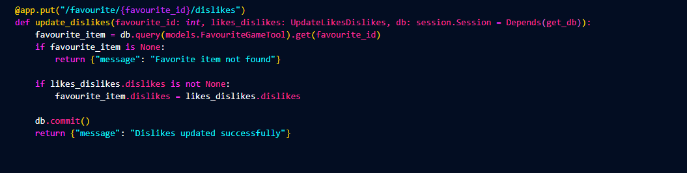

# ARVenture Execution Implementation Phase

## Table of contents

- [ARVenture Execution Implementation Phase](#arventure-execution-implementation-phase)
  - [Table of contents](#table-of-contents)
  - [Main Web Portfolio](#main-web-portfolio)
    - [Frontend](#frontend)
      - [Contact Us Section Code Snippet](#contact-us-section-code-snippet)
      - [HTML Validation](#html-validation)
    - [Pages](#pages)
    - [Backend (API)](#backend-api)
      - [Contact Us Endpoint Code Snippet](#contact-us-endpoint-code-snippet)
      - [Endpoints](#endpoints)
  - [Data Analysis Dashboard](#data-analysis-dashboard)
    - [Contact Us Analysis Code Snippet](#contact-us-analysis-code-snippet)
    - [Dashboard](#dashboard)
  - [Mobile Application](#mobile-application)
  - [AR System](#ar-system)

## Main Web Portfolio

### Frontend

#### Contact Us Section Code Snippet

```svelte
<script>
  import Dropdown from "../components/Dropdown.svelte";
  import InputWithIcon from "../components/InputWithIcon.svelte";
  import TextArea from "../components/TextArea.svelte";
  import Button from "../components/Button.svelte";
  import SubTitle from "../components/SubTitle.svelte";

  import sendContactAPI from "../api/send-contact.js";

  let firstName;
  let lastName;
  let gender;
  let countryCode;
  let mobile;
  let dateOfBirth;
  let email;
  let language;
  let messageBody;
  let country;

  const onSubmit = async () => {
    const result = await sendContactAPI();
  };
</script>

<form on:submit|preventDefault={onSubmit}>
  <SubTitle>Contact Us Now</SubTitle>
  <div class="name-container">
    <InputWithIcon
      placeholder="First Name"
      required
      bind:value={firstName}
      icon="bx bx-user"
      min={3}
      max={50}
    />
    <InputWithIcon
      placeholder="Last Name"
      required
      bind:value={lastName}
      icon="bx bx-user"
      min={3}
      max={50}
    />
  </div>
  <Dropdown
    bind:value={gender}
    label="Choose Gender"
    list={["Male", "Female"]}
  />
  <div class="phone-container">
    <Dropdown bind:value={countryCode} list={["+966", "+1", "+91"]} />
    <InputWithIcon
      type="tel"
      placeholder="Phone Number"
      required
      bind:value={mobile}
      icon="bx bx-phone"
      pattern="\d{10}"
      min={10}
      max={15}
    />
  </div>

  <InputWithIcon
    type="email"
    placeholder="Email Address"
    required
    bind:value={email}
    icon="bx bx-envelope"
    pattern="[a-z0-9._%+-]+@[a-z0-9.-]+\.[a-z]"
    min={6}
    max={100}
  />
  <Dropdown
    bind:value={language}
    label="Choose Language"
    list={["Arabic", "English", "Spanish", "French", "Chinese"]}
  />
  <InputWithIcon
    type="date"
    placeholder="Date of Birth"
    required
    bind:value={dateOfBirth}
  />
  <Dropdown
    bind:value={country}
    label="Choose Country"
    list={[
      "Saudi Arabia",
      "United States",
      "Germany",
      "United Kingdom",
      "China",
      "Spain",
      "Pakistan",
      "India",
    ]}
  />

  <TextArea placeholder="Message" bind:value={messageBody} />

  <Button type="full-width-radius" isSubmit={true}>Submit</Button>
</form>

<style>
  form {
    display: flex;
    flex-direction: column;
    justify-content: center;
    gap: 1.4vh;
    margin: 15px auto;
    width: 80vw;
    background-repeat: no-repeat;
    color: white;
    background-size: cover;
    background-image: url("/plainpurple.png");
    border: 2px solid rgba(255, 255, 255, 0.2);
    padding: 15px;
    border-radius: 15px;
  }
  .name-container {
    display: flex;
    gap: 15px;
  }
  .phone-container {
    display: flex;
    align-items: center;
    gap: 15px;
  }
</style>
```

#### HTML Validation

**Button** 



**Card** 



**Description** 


**Dropdown**


**InputWithIcon**


**LabelWithInput**



**Link**


**SubTitle**


**TextArea**


**Title**


**Video**


### Pages

**Home page in Desktop**:


**Home page in Tablet**:


**Home page in Mobile**:


**Login page in Desktop**:



**Login page in Tablet**:


**Login page in Mobile**:



**Sign up page in Desktop**:


**Sign up page in Tablet**:


**Sign up page in Mobile**:


**Product Page in Desktop**:


**Product Page in Tablet**:


**Product Page in Mobile**:


**Create Tool Page in Desktop**:


**Create Tool Page in Tablet**:


**Create Tool Page in Mobile**:



**Tools Page in Desktop**:


**Tools Page in Tablet**:


**Tools Page in Mobile**:


**About Us Page in Desktop**:


**About Us Page in Tablet**:


**About Us Page in Mobile**:


### Backend (API)

#### Contact Us Endpoint Code Snippet

```py


class Contact(BaseModel):
    firstName: str = Field(
        ...,
        min_length=3,
        max_length=50,
        description="First name should have 2-50 characters",
    )
    lastName: str = Field(
        ...,
        min_length=3,
        max_length=50,
        description="Last name should have 2-50 characters",
    )
    gender: str
    mobile: str = Field(
        ...,
        min_length=10,
        max_length=20,
        description="Mobile number should have 10-20 characters",
    )
    dateOfBirth: Optional[str]
    email: str = Field(
        ...,
        min_length=6,
        max_length=100,
        description="Email should have 5-100 characters",
    )
    language: str = Field(
        ...,
        min_length=2,
        max_length=50,
        description="Language should have 2-50 characters",
    )
    messageBody: str
    country: str = Field(
        ...,
        min_length=2,
        max_length=50,
        description="Country should have 2-50 characters",
    )


@app.post("/user/send_contact")
def contact_user(contact: Contact):
    try:
        query = "INSERT INTO contact (firstName, lastName, gender, mobile, dateOfBirth, email, language, messageBody, country) VALUES (%s, %s, %s, %s, %s, %s, %s, %s, %s)"
        values = (
            contact.firstName,
            contact.lastName,
            contact.gender,
            contact.mobile,
            datetime.strptime(contact.dateOfBirth, "%Y-%m-%d").strftime("%Y-%m-%d"),
            contact.email,
            contact.language,
            contact.messageBody,
            contact.country,
        )
        cursor.execute(query, values)
        conn.commit()
        return {"message": "Form sent successfully"}
    except ValueError as validation_error:
        raise HTTPException(status_code=400, detail=str(validation_error))
    except mysql.connector.Error as error:
        return {"message": "Failed to send form", "error": str(error)}

```

#### Endpoints

**Register Endpoint:**


POST register(username,email,password):
this end point must register the user in the database.

1-will receive the username,email,password from the front end request  
2-will store it in the database  
3-will return a message "user registration successful and data
(username,id) as a response

**Login Endpoint**



this end point must login the user from the database

1-will receive the username, password from the front end request  
2-will check if(username==database. Username and password ==database. Password)  
2.1-retrun a massage “login successful" as a response  
2.2else return a massage "Invalid username or password “as a response.

**Create Item Endpoint**


POST create_item(toolname,gamename):

this end point must store the favorite item in the database  
1-will receive the toolname,gamename from the front end request.  
2-will store it in the database.  
3-will return a message “Favorite item stored successfully" as a response.

**Get All Items Endpoint**


GET get_all_items(toolname,gamename):

this endpoint will display all the favorite items from the database  
1-it will search for all the favorite items(toolname,gamename,likes,dislikes in the database)  
2-it will return the items as a response to the frontend.

**displayuserinfo**


GET displayuserinfo (username, email):
this endpoint retrieves user information from the database and displays it.

1-It will search for user information in the database.  
2-it will check in the database the id for this user
(where id==username)  
3-It will retrieve the username and email for the user.  
4-It will return the user info as a response to the frontend.

**Update Likes Endpoint**


PUT update likes(favourite_id, likes dislikes):

1-Updates the number of likes for a specific favorite item in thdatabase.  
2-Receives the favourite_id as a path parameter and the likes_dislikes payload.  
3-Retrieves the favorite item with the given favourite_id from the database.  
4-If the favorite item is not found, returns a response with a message "Favorite item not found".  
5-If the likes value is provided in the payload, updates the likes field of the favorite item with the new value.  
6-Commits the changes to the database.  
7-Returns a response with a message "Likes updated successfully".

**Update Dislikes Endpoint**



PUT update_dislikes(favourite_id, likes_dislikes):

1-Updates the number of dislikes for a specific favorite item in the database.  
2-Receives the favourite_id as a path parameter and the likes_dislikes payload.  
3-Retrieves the favorite item with the given favourite_id from the database.  
4-If the favorite item is not found, returns a response with a message "Favorite item not found".  
5-If the dislikes value is provided in the payload, updates the dislikes field of the favorite item with the new value.  
6-Commits the changes to the database.  
7-Returns a response with a message "Dislikes updated successfully".

## Data Analysis Dashboard

### Contact Us Analysis Code Snippet

### Dashboard

## Mobile Application

> TODO

## AR System

> TODO
