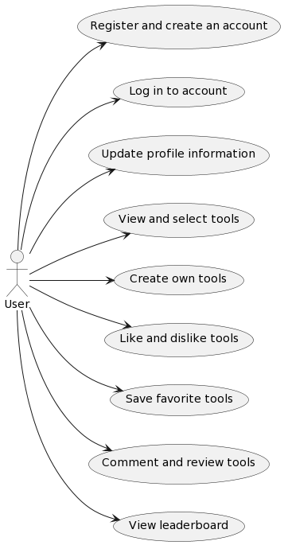
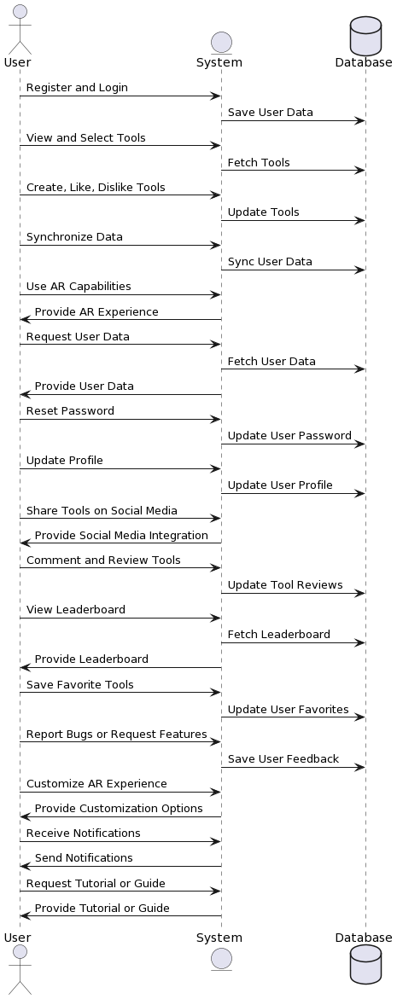

# ARVenture Execution Specification Phase

## Table of contents
- [ARVenture Execution Specification Phase](#arventure-execution-specification-phase)
  - [Table of contents](#table-of-contents)
  - [Functional Requirements](#functional-requirements)
    - [User Requirements](#user-requirements)
    - [System Requirements](#system-requirements)
  - [Non Functional Requirements (Quality Attributes)](#non-functional-requirements-quality-attributes)
  - [Business Requirements](#business-requirements)

## Functional Requirements
### User Requirements
- Users should be able to register and create an account.
- Users should be able to log in to their account.
- Users should be able to view and select from a list of tools from different games.
- Users should be able to create their own tools.
- Users should be able to like and dislike tools.
- Users should be able to log in to the mobile app with the same account.
- Users should be able to open the camera on the mobile app and view objects.
- Users should be able to view and create tools on the mobile app.
- Users should be able to interact with the AR environment using the selected or created tools.
- Users should be able to save their progress and settings.
- Users should be able to reset their password.
- Users should be able to update their profile information.
- Users should be able to share their created tools on social media.
- Users should be able to comment on and review tools.
- Users should be able to view a leaderboard of most liked tools.
- Users should be able to save their favorite tools.
- Users should be able to report bugs or issues within the system.
- Users should be able to request new features or tools.
- Users should be able to customize their AR experience (e.g., adjust settings).
- Users should be able to receive notifications about updates or new features.

### System Requirements
- The system should allow user registration and login.
- The system should maintain a database of tools from different games.
- The system should allow users to create, like, and dislike tools.
- The system should synchronize user data between the portfolio website and the mobile app.
- The system should provide AR capabilities, converting real-world objects into game-like objects.
- The system should allow admins to view and analyze user data.
- The system should support password reset functionality.
- The system should support profile updates.
- The system should support social media integration for sharing tools.
- The system should support a commenting and review system for tools.
- The system should maintain a leaderboard of most liked tools.
- The system should support a favorites system for users to save their favorite tools.
- The system should support a bug reporting and feature request system.
- The system should support user customization of the AR experience.
- The system should support a notification system for updates or new features.
- The system should support a tutorial or guide system for new users.

## Non Functional Requirements (Quality Attributes)
1. **Performance**:

- The system should provide a seamless AR experience with minimal latency.
- The system should be able to handle multiple users at the same time.
- The system should ensure fast load times for a smooth user experience.
- The system should be able to quickly process and reflect changes in likes and dislikes.
- The system should provide a robust search functionality for users to find tools.

2. **Security**:

- The system should ensure the privacy and security of user data.
- The system should provide a secure environment for user data.

3. **Availability**:

- The system should provide high availability and reliability.
- The system should be able to handle high traffic during peak times.

4. **Scalability**:

- The system should be scalable to accommodate a growing number of users.

5. **Usability**:

- The system should provide a user-friendly interface.
- The system should provide a responsive and intuitive user interface.
- The system should provide a tutorial or guide for new users.
- The system should provide a help or FAQ section for users.

6. **Maintainability**:

- The system should be maintainable and allow for future updates and improvements.
- The system should provide a logging system for tracking user activities and system errors.

7. **Interoperability**:

- The system should be compatible with various AR glasses.
- The system should provide a smooth transition between the website and mobile app.
- The system should provide a consistent user experience across different devices.
- The system should be compatible with various operating systems and devices.

8. **Manageability**:

- The system should provide an admin panel for managing users, tools, and system settings.

9. **Data Integrity**:

- The system should ensure data integrity and security.
- The system should provide a backup system to prevent data loss.

10. **Analytics**:

- The system should provide a reporting system for generating user and system analytics.

## Business Requirements
- The system should attract and retain a large user base to ensure the viability and profitability of the project.
- The system should differentiate itself from competitors through unique features and a superior user experience.
- The system should generate revenue through various streams such as advertisements, in-app purchases, or subscriptions.
- The system should comply with all relevant laws and regulations, including data privacy and protection laws.
- The system should be scalable to support growth and expansion into new markets.
- The system should maintain a high level of system availability and reliability to ensure user satisfaction.
- The system should provide comprehensive customer support to address user issues and inquiries.
- The system should regularly update and improve based on user feedback and market trends.
- The system should establish partnerships with other companies for cross-promotion or feature integration.
- The system should implement effective marketing strategies to increase brand awareness and user acquisition.
- The system should provide a safe and respectful environment for users, with measures to prevent and address inappropriate behavior.
- The system should maintain a positive company image and reputation.
- The system should ensure the security of user data and transactions.
- The system should provide a platform for community interaction and engagement.
- The system should offer a variety of tools and features to cater to different user preferences.
- The system should facilitate easy and secure user registration and login.
- The system should provide a seamless transition between the website and mobile app.
- The system should offer a rewarding and enjoyable AR experience.
- The system should provide regular updates and new features to keep users engaged.
- The system should have a user-friendly interface that is easy to navigate.
- The system should provide a tutorial or guide for new users.
- The system should have a robust search functionality for users to find tools.
- The system should offer a favorites system for users to save their favorite tools.
- The system should have a commenting and review system for tools.
- The system should maintain a leaderboard of most liked tools.
- The system should support social media integration for sharing tools.
- The system should have a bug reporting and feature request system.
- The system should provide a help or FAQ section for users.
- The system should provide a notification system for updates or new features.
- The system should provide an admin panel for managing users, tools, and system settings.
