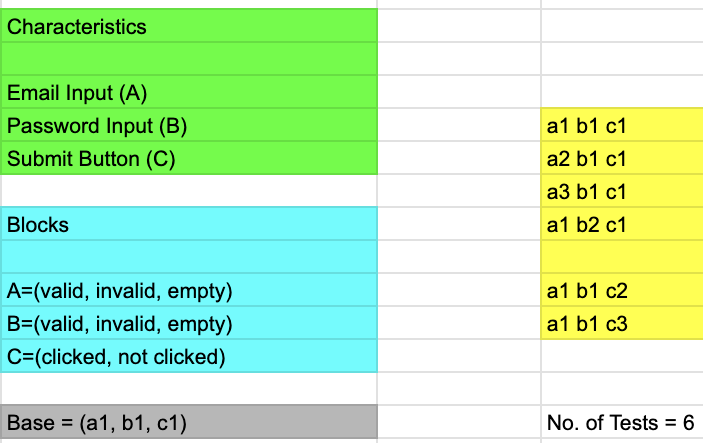
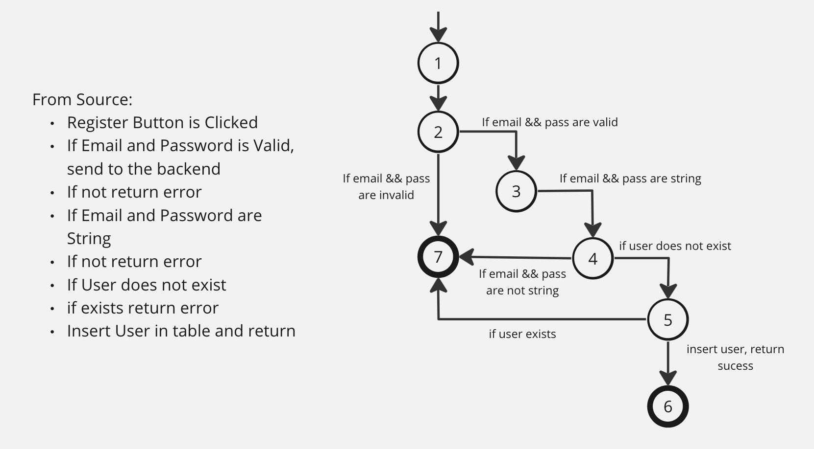
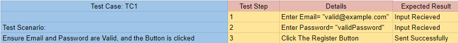

# ARVenture Execution V&V (Testing) Phase

## Table of contents
- [ARVenture Execution V\&V (Testing) Phase](#arventure-execution-vv-testing-phase)
  - [Table of contents](#table-of-contents)
- [Software Testing Phases](#software-testing-phases)
  - [1. Design](#1-design)
    - [1. Human Based](#1-human-based)
    - [2. Criteria Based](#2-criteria-based)
      - [Test Criterion (Rules)](#test-criterion-rules)
      - [Test Requirements](#test-requirements)
      - [Coverage Criteria](#coverage-criteria)
      - [Functional](#functional)
      - [Non Functional](#non-functional)
      - [Test Sets (Test Cases)](#test-sets-test-cases)
      - [TC1 From TS1](#tc1-from-ts1)
      - [TC2 From TS1](#tc2-from-ts1)
  - [2. Automation](#2-automation)
      - [TC1 Automation From TS1](#tc1-automation-from-ts1)
  - [3. Execution](#3-execution)
  - [4. Evaluation](#4-evaluation)


# Software Testing Phases
## 1. Design
In this phase we will design test cases.
### 1. Human Based

### 2. Criteria Based
#### Test Criterion (Rules)
1. Test Basic Working Functionalities
2. Test Essential Working Functionalities

#### Test Requirements
1. Test Register funcionalities
2. Test Login funcionalities
3. Test Items functionalities
4. Test Home UI Components
5. Other Test Requirements is assigned as "LATER".

#### Coverage Criteria
1. For ISP Coverage: We will choose ACoC (All Combinations) Coverage Criteria, since we want to ensure minimal test cases with maximum benifit.
2. For Graph Coverage: We will choose CPC (Complete Path) Coverage Criteria, since we plan to use it in integration between frontend and backend.
3. For Logic Coverage: We will choose PC (Predicate) Coverage Criteria, since we only want to use it in validation statements.
4. For Syntantic Coverage: We will not cover this coverage section since it is not included in the course.

#### Functional
- **Unit Testing** Test Set (TS1): Using **Input Domain Coverage** 

    1. (TC1): Ensure Email and Password are Valid, and the Button is clicked
    2. (TC2): Ensure Email is invalid and Password is Valid, and the Button is clicked
    3. (TC3): Ensure Email is empty and Password is Valid, and the Button is clicked
    4. (TC4): Ensure Email is valid and Password is invalid, and the Button is clicked
    5. (TC5): Ensure Email is valid and Password is empty, and the Button is clicked
    6. (TC6): Ensure Email is valid and Password is valid, and the Button is not clicked
- **Integration Testing** Test Set (TS2): Using **Logic Coverage**
    1. (TC7): Ensure sending email and password as a string and user does not exist. User should be registered
    2. (TC8): Ensure sending email and password as not a string and user exists. User should not be registered
    3. (TC9): Ensure sending email and password as a string and user exists. User should login
    4. (TC10): Ensure sending email and password as not a string andand user does not exist. User should not login
```
  Predicate 1 (P1): Email is a string
  Predicate 2 (P2): Password is a string
  Predicate 3 (P3): user does not exist
  Predicate 4 (P4): user already exists

  Register True Expression: (P1 or P2) and (P3)
  Register False Expression: (not P1 or not P2) and (P4)

  Login True Expression: (P1 or P2) and (P4)
  Login False Expression: (not P1 or not P2) and (P3)
```
  
- **System Testing** Test Set (TS3): Using **Graph Coverage**

    1. (TC11): Path(1,2,7)
    2. (TC12): Path(1,2,3,7)
    3. (TC13): Path(1,2,3,4,7)
    4. (TC14): Path(1,2,3,4,5,7)
    5. (TC15): Path(1,2,3,4,5,6)
   
#### Non Functional

> TODO

- **Performance Testing** Test Set (TSx): Using **Logic Coverage**
- **Availability Testing** Test Set (TSx): Using **Logic Coverage**
- **Security Testing** Test Set (TSx): Using **Graph Coverage**

#### Test Sets (Test Cases)
#### TC1 From TS1

#### TC2 From TS1
       
## 2. Automation
#### TC1 Automation From TS1
```js
  // sum.test.js
  import { expect, test } from 'vitest'
  import { sum } from './sum'

  test('adds 1 + 2 to equal 3', () => {
    expect(sum(1, 2)).toBe(3)
  })
```
## 3. Execution
## 4. Evaluation


