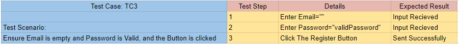

# ARVenture Execution V&V (Testing) Phase

## Table of contents

- [ARVenture Execution V\&V (Testing) Phase](#arventure-execution-vv-testing-phase)
  - [Table of contents](#table-of-contents)
- [Testing tools used](#testing-tools-used)
- [Software Testing Phases](#software-testing-phases)
  - [Design](#design)
    - [1. Human Based](#1-human-based)
    - [2. Criteria Based](#2-criteria-based)
      - [Test Criterion (Rules)](#test-criterion-rules)
      - [Test Requirements](#test-requirements)
      - [Coverage Criteria](#coverage-criteria)
      - [Functional](#functional)
      - [Non Functional](#non-functional)
      - [Test Sets (Test Cases)](#test-sets-test-cases)
      - [TC1 From TS1](#tc1-from-ts1)
      - [TC2 From TS1](#tc2-from-ts1)
      - [TC3 From TS1](#tc3-from-ts1)
      - [TC4 From TS1](#tc4-from-ts1)
      - [TC5 From TS1](#tc5-from-ts1)
      - [TC6 From TS1](#tc6-from-ts1)
      - [TC7 From TS1](#tc7-from-ts1)
      - [TC8 From TS1](#tc8-from-ts1)
      - [TC9 From TS1](#tc9-from-ts1)
      - [TC10 From TS1](#tc10-from-ts1)
  - [Automation](#automation)
      - [TC1 Automation From TS1](#tc1-automation-from-ts1)
      - [TC2 Automation From TS1](#tc2-automation-from-ts1)
      - [TC3 Automation From TS1](#tc3-automation-from-ts1)
      - [TC4 Automation From TS1](#tc4-automation-from-ts1)
      - [TC5 Automation From TS1](#tc5-automation-from-ts1)
      - [TC6 Automation From TS1](#tc6-automation-from-ts1)
      - [TC7 Automation From TS2](#tc7-automation-from-ts2)
      - [TC8 Automation From TS2](#tc8-automation-from-ts2)
      - [TC9 Automation From TS2](#tc9-automation-from-ts2)
      - [TC10 Automation From TS2](#tc10-automation-from-ts2)
  - [Execution](#execution)
    - [Automatic](#automatic)
      - [Frontend](#frontend)
        - [Running Vitest for All TS1 and TS2](#running-vitest-for-all-ts1-and-ts2)
    - [Manual](#manual)
      - [Backend](#backend)
        - [TC12 Manual Execution From TS3](#tc12-manual-execution-from-ts3)
        - [TC13 Manual Execution From TS3](#tc13-manual-execution-from-ts3)
        - [TC14 Manual Execution From TS3](#tc14-manual-execution-from-ts3)
        - [TC15 Manual Execution From TS3](#tc15-manual-execution-from-ts3)
  - [Evaluation](#evaluation)
    - [Frontend Reports](#frontend-reports)
    - [Backend Reports](#backend-reports)

# Testing tools used
- Vitest (For Automated Frontend Functional Testing)
- Lighthouse (For Automated Frontend Nonfunction Testing)
- Postman (For Manual Backend Functional Testing)

# Software Testing Phases

## Design

In this phase we will design test cases.

### 1. Human Based

1. Test AR Adventure Experience

### 2. Criteria Based

#### Test Criterion (Rules)

1. Test Basic Working Functionalities
2. Test Essential Working Functionalities

#### Test Requirements

1. Test Register funcionalities (DONE)
2. Test Login funcionalities (DONE)
3. Test Items functionalities (NOT IMPLEMENTED)
4. Test Home UI Components (NOT IMPLEMENTED)
5. Test Create Tool UI Components (NOT IMPLEMENTED)
6. Test Search Tools UI Components (NOT IMPLEMENTED)
7. Test Product UI Components (NOT IMPLEMENTED)
8. Test About Us UI Components (NOT IMPLEMENTED)
9. Other Test Requirements is assigned as "LATER".

#### Coverage Criteria

1. For ISP Coverage: We will choose BCC (Base Choice) Coverage Criteria, since we want to ensure minimal test cases with maximum benifit.
2. For Graph Coverage: We will choose CPC (Complete Path) Coverage Criteria, since we plan to use it in integration between frontend and backend.
3. For Logic Coverage: We will choose PC (Predicate) Coverage Criteria, since we only want to use it in validation statements.
4. For Syntantic Coverage: We will choose to use this coverage in HTML and CSS Components

#### Functional

[Excel Document](https://docs.google.com/spreadsheets/d/1PXeD7YKlPjDotzDKKR61ubJKgNtq_t0Pj6YmkRVE04s/edit#gid=0)

- **Unit Testing** Test Set (TS1): Using **Input Domain Coverage**
  

1. **(TC1)**: Ensure Email and Password are Valid, and the Button is clicked
2. **(TC2)**: Ensure Email is invalid and Password is Valid, and the Button is clicked
3. **(TC3)**: Ensure Email is empty and Password is Valid, and the Button is clicked
4. **(TC4)**: Ensure Email is valid and Password is invalid, and the Button is clicked
5. **(TC5)**: Ensure Email is valid and Password is empty, and the Button is clicked
6. **(TC6)**: Ensure Email is valid and Password is valid, and the Button is not clicked

- **Integration Testing** Test Set (TS2): Using **Logic Coverage**

1. **(TC7)**: Ensure sending email and password as a string and user does not exist. User should be registered
2. **(TC8)**: Ensure sending email and password as not a string and user exists. User should not be registered
3. **(TC9)**: Ensure sending email and password as a string and user exists. User should login
4. **(TC10)**: Ensure sending email and password as not a string and user does not exist. User should not login

```
  Predicate 1 (P1): Email is a string
  Predicate 2 (P2): Password is a string
  Predicate 3 (P3): user does not exist
  Predicate 4 (P4): user already exists

  Register True Expression: (P1 or P2) and (P3)
  Register False Expression: (not P1 or not P2) and (P4)

  Login True Expression: (P1 or P2) and (P4)
  Login False Expression: (not P1 or not P2) and (P3)
```

- **System Testing** Test Set (TS3): Using **Graph Coverage**
  

1. **(TC11)**: Path(1,2,7)
2. **(TC12)**: Path(1,2,3,7)
3. **(TC13)**: Path(1,2,3,4,7)
4. **(TC14)**: Path(1,2,3,4,5,7)
5. **(TC15)**: Path(1,2,3,4,5,6)

#### Non Functional

- **Performance Testing** Test Set (TS16): Using **Logic Coverage**
  
- **Availability Testing** Test Set (TSx): Using **Logic Coverage**
- **Security Testing** Test Set (TSx): Using **Graph Coverage**

#### Test Sets (Test Cases)

#### TC1 From TS1


#### TC2 From TS1


#### TC3 From TS1



#### TC4 From TS1


#### TC5 From TS1


#### TC6 From TS1


#### TC7 From TS1


#### TC8 From TS1


#### TC9 From TS1


#### TC10 From TS1


## Automation

#### TC1 Automation From TS1

```js
// Test Case 1
test("(TC1) Ensure Email and Password are Valid, and the Button is clicked", async () => {
  expect(
    await register(
      "validUsername",
      "valid@example.com",
      "validPassword",
      "validCountry",
      "localhost:9090"
    )
  ).toBe("Register Information is Ready To Send");
});
```

#### TC2 Automation From TS1

```js
// Test Case 2
test("(TC2) Ensure Email is invalid and Password is Valid, and the Button is clicked", async () => {
  expect(
    await register(
      "validUsername",
      "invalidEmail",
      "validPassword",
      "validCountry"
    )
  ).toBe("Invalid Email (missing '@')");
});
```

#### TC3 Automation From TS1

```js
// Test Case 3
test("(TC3) Ensure Email is empty and Password is Valid, and the Button is clicked", async () => {
  expect(
    await register("validUsername", "", "validPassword", "validCountry")
  ).toBe("Empty Email");
});
```

#### TC4 Automation From TS1

```js
// Test Case 4
test("(TC4) Ensure Email is valid and Password is invalid, and the Button is clicked", async () => {
  expect(
    await register("validUsername", "valid@example.com", "", "validCountry")
  ).toBe("Empty Password");
});
```

#### TC5 Automation From TS1

```js
// Test Case 5
test("(TC5) Ensure Email is valid and Password is empty, and the Button is clicked", async () => {
  expect(
    await register("validUsername", "valid@example.com", "", "validCountry")
  ).toBe("Empty Password");
});
```

#### TC6 Automation From TS1

```js
// Test Case 6
test("(TC6) Ensure Email is valid and Password is valid, and the Button is not clicked", () => {
  return "Nothing will happen";
});
```

#### TC7 Automation From TS2

```js
/* Integration Testing */
// Test Case 7
test("(TC7) Ensure sending email and password as a string and user does not exist. User should be registered", async () => {
  expect(
    await register(
      "nonexistentUser",
      "nonexistentUser@gmail.com1",
      "fakePassword",
      "fakeCountry"
    )
  ).toBe("User registration successful");
});
```

#### TC8 Automation From TS2

```js
// Test Case 8
test("(TC8) Ensure sending email and password as not a string and user exists. User should not be registered", async () => {
  // Assuming there is an existing user with the given details
  expect(await register("existingUser", 0, 0, "fakeCountry")).toBe(
    "Please Enter String Password"
  );
});
```

#### TC9 Automation From TS2

```js
// Test Case 9
test("(TC9) Ensure sending email and password as a string and user exists. User should login", async () => {
  expect(await login("existingUser", "fakePassword")).not.toBe(undefined); // access token Recieved (that means there is a user and it is logged in)
});
```

#### TC10 Automation From TS2

```js
// Test Case 10
test("(TC10) Ensure sending email and password as not a string and user does not exist. User should not login", async () => {
  expect(await login(0, 0)).toBe("Please Enter String Password");
});
```

## Execution

### Automatic

#### Frontend

##### Running Vitest for All TS1 and TS2


### Manual

#### Backend

##### TC12 Manual Execution From TS3

##### TC13 Manual Execution From TS3


##### TC14 Manual Execution From TS3

##### TC15 Manual Execution From TS3

## Evaluation

### Frontend Reports


### Backend Reports
