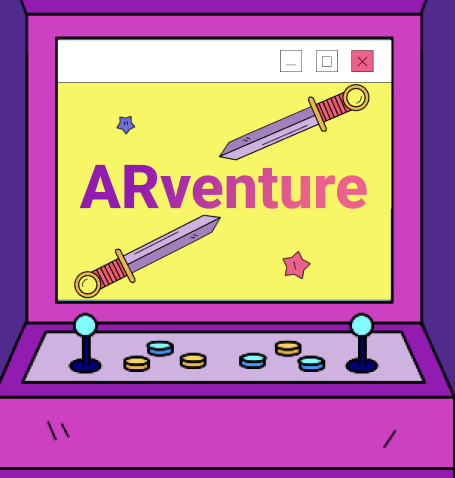

# ARVenture Project Initiation Phase

## Table of contents
- [ARVenture Project Initiation Phase](#arventure-project-initiation-phase)
  - [Table of contents](#table-of-contents)
  - [Business Case Analysis](#business-case-analysis)
    - [Strategic Business Objective](#strategic-business-objective)
    - [Initial Project Business Requirements](#initial-project-business-requirements)
    - [Budget Estimates and Financial Analysis](#budget-estimates-and-financial-analysis)
      - [Cost Estimates](#cost-estimates)
      - [Financial Analysis](#financial-analysis)
    - [SWOT Analysis](#swot-analysis)
  - [Stakeholders](#stakeholders)
    - [Fictitious Project Stakeholder Register Report](#fictitious-project-stakeholder-register-report)
    - [Fictitious Management Strategy of Stakeholders](#fictitious-management-strategy-of-stakeholders)
  - [Project Charter](#project-charter)
    - [Project Title](#project-title)
    - [Project Objective](#project-objective)
    - [Project Scope](#project-scope)
    - [Project Deliverables](#project-deliverables)

## Business Case Analysis

### Strategic Business Objective
The strategic business objective of our startup is to revolutionize the
gaming industry by introducing an AI Game system that offers a highly
immersive and realistic gaming experience. Our goal is to develop
comfortable and modern AR glasses that enable players to interact with
virtual objects mapped to real-world surroundings. By creating a
multiplayer game with a story mode and interactive missions, we aim to
provide gamers with a unique and captivating gaming experience.

### Initial Project Business Requirements

Convert Detailed requirements to high level buinesss-related here.

### Budget Estimates and Financial Analysis

#### Cost Estimates
Software development (including design and development): \$55,000.

Hardware development (AR glasses): \$25,000

Debugging, quality assurance, and user testing: 20,000\$

#### Financial Analysis

1. **Net Present Value (NPV)**
Discount rate: 10% (assumed)

2. **Estimated Cash Inflows and Outflows**

| Cash Inflow | Amount |
|-------------|--------|
| Year 1      | \$30,000 |
| Year 2      | \$40,000 |
| Year 3      | \$50,000 |
| Year 4      | \$60,000 |
| Year 5      | \$70,000 |

| Cash Outflow | Amount |
|--------------|--------|
| Software development | \$55,000 |
| Hardware development | \$25,000 |
| Testing | \$20,000 |

3. **NPV & ROI**
   
> Assuming a 5-year project lifespan, the NPV calculation would be as
> follows:\
> The positive NPV indicates that the project is expected to generate a
> net profit of \$73,790.

The ROI for the project is approximately 73.79%.

4. **Payback Analysis**

| Cumulative Cash Inflow | Amount |
|------------------------|--------|
| Year 1 | **\$30,000** |
| Year 2 | **\$70,000** |
| Year 3 | **\$120,000** |
| Year 4 | **\$180,000** |
| Year 5 | **\$250,000** |

Based on the cumulative cash flows, the payback period for the project
is 3 years. This means that it will take approximately 3 years to
recover the initial investment of \$100,000.

### SWOT Analysis

| Strengths | Weaknesses |
|-----------|------------|
| - Unique and innovative concept in the gaming industry. | - Reliance on AR technology, which may have limitations and challenges. |
| - Highly immersive and realistic gaming experience. | - Initial investment required for hardware development. |
| - Potential for significant growth and profitability. | - Competition from existing gaming companies. |
| - Strong expertise and skills within the core team. | |

| Opportunities | Threats |
|---------------|---------|
| - Growing demand for immersive gaming experiences. | - Rapidly evolving technology landscape. |
| - Expansion into other markets and industries. | - Intense competition within the gaming industry. |
| - Potential partnerships with AR technology providers. | - Economic uncertainties and market fluctuations. |

## Stakeholders
### Fictitious Project Stakeholder Register Report
| Role | Name | Description |
|------|------|-------------|
| Investor | **Investors** | Primary investors and project sponsors. Regularly updated on project progress and financials. |
| External Security and System Admin | **Fawaz Khosaifan** | Conducts penetration testing, system analysis, and secures the platform. Manages the IT infrastructure on AWS. |
| Backend Developer | **Ziyad Alghamdi** | Establishes and develops the backend structure and API. |
| Software Architect Lead, Software Engineer, Project Manager | **Anmar Hani** | Collaborates with the software expert to align project objectives and technical requirements. |
| Mobile Developer and Hardware Builder | **Yaser Kaid** | Develops the mobile application and constructs the AR glasses hardware. |
| FullStack Designer | **Raef Shah** | Manages timelines and oversees the design aspects of the project. |
| Web Frontend Developer | **Mohammed Alsaadwi** | Codes the frontend of the website. |
| Customers | **VR and AR Users** | End-users of the product, providing feedback and driving demand. |
| Potential Stakeholder | **Regulatory Bodies** | Ensures compliance with all relevant regulations and standards. |

### Fictitious Management Strategy of Stakeholders

1. **Investors**:

Maintain consistent communication with investors, providing them with regular updates on project progress, financial analyses, and future growth projections. Emphasize the potential for substantial return on investment and sustained profitability. Encourage their participation in key project decisions and milestones.

2. **External Security and System Admin Contractor (Fawaz Khosaifan)**:

Fawaz will be responsible for penetration testing, system analysis, and security of the platform. He will also manage the IT infrastructure on AWS, ensuring system operations are running smoothly and securely.

3. **Core Team Backend Developer and Data Analyst (Ziyad Alghamdi)**: 

Ziyad will be responsible for establishing the backend structure and API, and developing them. Also, he will be responsible for analysing data and managing dashboards of data.

4. **Core Team Software Architect Lead, Software Engineer, and Project Manager (Anmar Hani)**:

Work closely with the software expert to ensure alignment between project objectives and technical requirements. Provide the necessary resources and support for software development activities. Facilitate open communication to address any technical issues or obstacles.

5. **Core Team Mobile Developer and Hardware Builder (Yaser Kaid)**:

Yaser will be tasked with developing the mobile application and constructing the AR glasses hardware.

6. **Core Team FullStack Designer (Raef Shah)**:

Raef will be in charge of managing timelines and overseeing the design aspects of the project.

7. **Core Team Web Frontend Developer (Mohammed Alsaadwi)**:

Mohammed will be responsible for coding the frontend of the website.

8. **Customers (VR and AR Users)**:

Carry out market research and collect customer feedback to guide product development. Engage with customers through surveys, focus groups, and beta testing programs. Continually enhance the adventure experience based on customer preferences and expectations.

9. **Potential Stakeholder (Regulatory Bodies)**:

Ensure compliance with all relevant regulations and standards. Regularly update regulatory bodies on project progress and any changes in operations.

## Project Charter

### Project Title
**ARVenture**

###  Project Objective

Develop an AI adventure system that provides a unique and immersive adventure
experience by leveraging AR technology and real-world object
transformation. The project aims to capture a significant market share
in the VR and AR industry and generate substantial returns on
investment.

### Project Scope

-   Software development: Design and implement a highly interactive and
    engaging system software.

-   Hardware development: Create comfortable and technologically
    advanced AR glasses.

-   Design and development: Incorporate realistic mapping of
    real-world objects into the system.

-   Quality assurance and testing: Conduct extensive testing to ensure a
    seamless user experience.

-   Deployment and launch: Release the AI adventure system in the market and
    establish a strong presence.

### Project Deliverables
-   Fully functional AI adventure and AR VR software.

-   High-quality AR glasses with advanced features.

-   Realistic mapping of real-world objects in the system.

-   Thoroughly tested and bug-free software system.

-   Successfully launched AI product (software and hardware) system in the market

