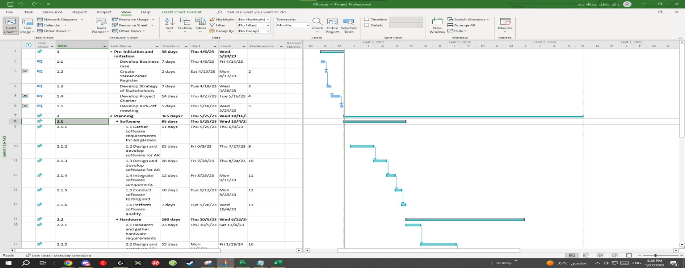
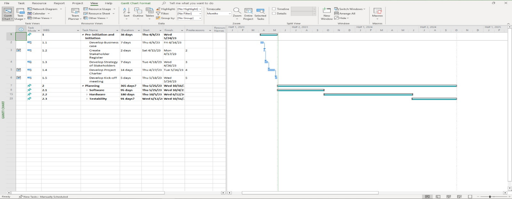

# ARVenture Project Planning Phase

# Planning Stage of Scope, Time, and Cost

## Project Scope Statement

- Development of an AI adventure software that enables players to transform
real-world objects into virtual objects within the system.

- Creation of comfortable and technologically advanced AR glasses for an
immersive adventure experience

- Integration of multiplayer functionality to allow players to meet in
real-world locations and engage in collaborative gameplay.

- Design and implementation of various game missions, objectives, and
challenges to ensure a dynamic and engaging gaming experience.

- Development of a user-friendly interface for seamless navigation and
interaction within the game.

- Inclusion of in-game rewards, abilities, and power-ups tied to
real-world objects to enhance gameplay and encourage player
participation.

- Quality assurance and testing of the AI game system to identify and
resolve any bugs or performance issues.

- Deployment of the AI game system in the market, including marketing and
promotional activities to attract VR and AR gamers.

## WBS (Work Breakdown Structure)

## WBS Gantt Chart

##  **Network Diagram for the activities**

## Cost Baseline Cashflow

