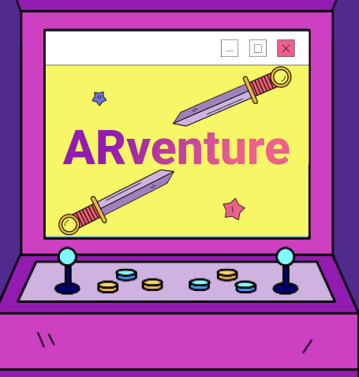
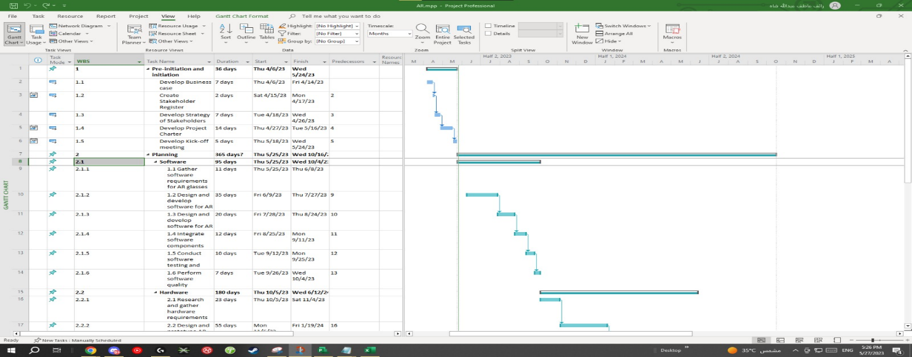
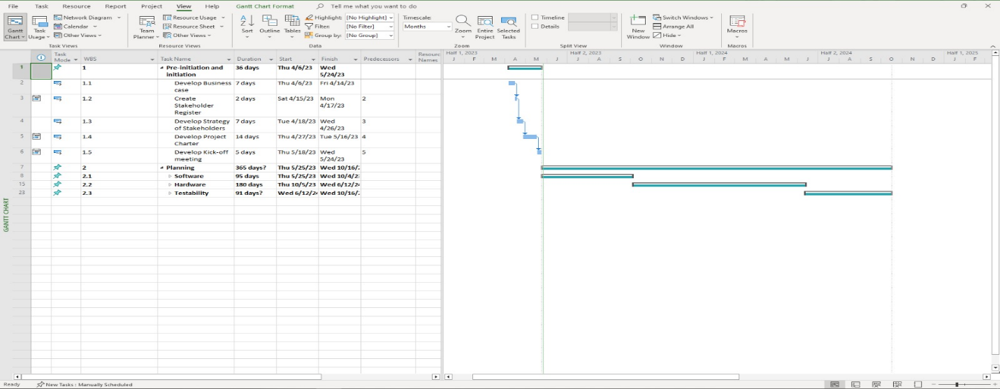
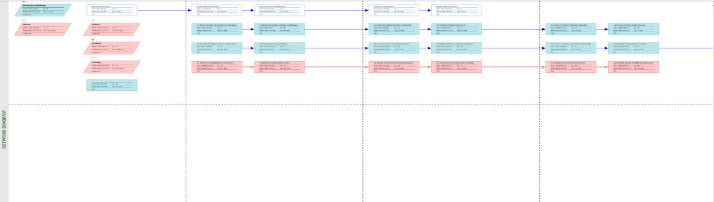

**Project Management\
ARventure**

{width="3.159884076990376in"
height="3.319615048118985in"}

**Members:\
- Raef Shah 2141165**

**- Anmar Hani 2140004\
- Mohammed Alsaadwi 2140519**

**- Yaser Kaid 2140847**

# 

# **Table of Contents** {#table-of-contents .TOC-Heading}

[**1.** **Stage I: Pre-initiation and Initiation Stage**
[3](#stage-i-pre-initiation-and-initiation-stage)](#stage-i-pre-initiation-and-initiation-stage)

[**1.1** **Business Case Analysis**
[3](#business-case-analysis)](#business-case-analysis)

[**1.1.1** **Strategic Business Objective**
[3](#strategic-business-objective)](#strategic-business-objective)

[**1.1.2** **Initial Software Engineering Requirements**
[3](#initial-software-engineering-requirements)](#initial-software-engineering-requirements)

[**1.1.3** **Budget Estimates and Financial Analysis**
[3](#budget-estimates-and-financial-analysis)](#budget-estimates-and-financial-analysis)

[**1.1.4** **Cost Estimates** [3](#cost-estimates)](#cost-estimates)

[**1.1.5** **Financial Analysis**
[3](#financial-analysis)](#financial-analysis)

1.  # **Stage I: Pre-initiation and Initiation Stage**

    1.  ## **Business Case Analysis**

        1.  ### **Strategic Business Objective**

The strategic business objective of our startup is to revolutionize the
gaming industry by introducing an AI Game system that offers a highly
immersive and realistic gaming experience. Our goal is to develop
comfortable and modern AR glasses that enable players to interact with
virtual objects mapped to real-world surroundings. By creating a
multiplayer game with a story mode and interactive missions, we aim to
provide gamers with a unique and captivating gaming experience.

### **Initial Software Engineering Requirements**

1.  Development of an AI Game system compatible with AR glasses.

2.  Integration of real-world object mapping to enhance realism.

3.  Design of comfortable and modern AR glasses for optimal user
    > experience.

4.  Development of game mechanics, character models, and special
    > effects.

    1.  ### **Budget Estimates and Financial Analysis**

Estimated Budget: \$100,000

### **Cost Estimates**

Software development (including game design and development): \$55,000.

Hardware development (AR glasses): \$25,000

Debugging, quality assurance, and user testing: 20,000\$

3.  ### **Financial Analysis**

    1.  #### Net Present Value (NPV)

Discount rate: 10% (assumed)

#### Estimated Cash Inflows and Outflows

  -----------------------------------------------------------------------
  Cash Inflow                          
  ------------------------------------ ----------------------------------
  Year 1                               \$30,000

  Year 2                               \$40,000

  Year 3                               \$50,000

  Year 4                               \$60,000

  Year 5                               \$70,000
  -----------------------------------------------------------------------

  -----------------------------------------------------------------------
  Cash Outflow                         
  ------------------------------------ ----------------------------------
  Software development                 \$55,000

  Hardware development                 \$25,000

  Testing                              \$20,000
  -----------------------------------------------------------------------

####  NPV & ROI

> Assuming a 5-year project lifespan, the NPV calculation would be as
> follows:\
> The positive NPV indicates that the project is expected to generate a
> net profit of \$73,790.

The ROI for the project is approximately 73.79%.

#### Payback Analysis

  -----------------------------------------------------------------------
  Cumulative Cash Inflow               
  ------------------------------------ ----------------------------------
  Year 1                               **\$30,000**

  Year 2                               **\$70,000**

  Year 3                               **\$120,000**

  Year 4                               **\$180,000**

  Year 5                               **\$250,000**
  -----------------------------------------------------------------------

Based on the cumulative cash flows, the payback period for the project
is 3 years. This means that it will take approximately 3 years to
recover the initial investment of \$100,000.

### **SWOT Analysis**

  -----------------------------------------------------------------------

  -----------------------------------------------------------------------

+------------------------------+---------------------------------------+
| Strengths                    | **Weaknesses**                        |
+------------------------------+---------------------------------------+
| -   Unique and innovative    | -   **Reliance on AR technology,      |
|     concept in the gaming    |     which may have limitations and    |
|     industry.                |     challenges.**                     |
|                              |                                       |
| -   Highly immersive and     | -   **Initial investment required for |
|     realistic gaming         |     hardware development.**           |
|     experience.              |                                       |
|                              | -   **Competition from existing       |
| -   Potential for            |     gaming companies.**               |
|     significant growth and   |                                       |
|     profitability.           |                                       |
|                              |                                       |
| -   Strong expertise and     |                                       |
|     skills within the core   |                                       |
|     team.                    |                                       |
+------------------------------+---------------------------------------+
| Opportunities                | **Threats**                           |
+------------------------------+---------------------------------------+
| -   Growing demand for       | -   **Rapidly evolving technology     |
|     immersive gaming         |     landscape.**                      |
|     experiences.             |                                       |
|                              | -   **Intense competition within the  |
| ```{=html}                   |     gaming industry.**                |
| <!-- -->                     |                                       |
| ```                          | -   **Economic uncertainties and      |
| -   Expansion into other     |     market fluctuations.**            |
|     markets and industries.  |                                       |
|                              |                                       |
| -   Potential partnerships   |                                       |
|     with AR technology       |                                       |
|     providers.               |                                       |
+------------------------------+---------------------------------------+

##  

## **Fictitious Project Stakeholder Register Report**

  -----------------------------------------------------------------------
  Role                Name           Description
  ------------------- -------------- ------------------------------------
  Investor            **Dr. Wafa     **Primary investor and project
                      Ghonaim**      sponsor**

  External Consultant **Ammar        **Role: Providing expert advice on
                      Alhazmi**      market trends, gaming industry
                                     insights, and strategic guidance**

  External            **Ziyad        **Role: Assisting in hardware
  Subcontractor       Alghamdi**     development, specifically AR glasses
                                     design and manufacturing**

  Software Expert     **Ammar        **Role: Leading the software
                      Alhazmi**      development and game design
                                     activities.**

  Hardware Expert     **Yaser Kaid** **Role: Overseeing the hardware
                                     development, focusing on AR glasses
                                     functionality and performance**

  Project Manager     **Raef Shah**  **Role: Responsible for overall
                                     project coordination, scheduling,
                                     and ensuring timely delivery.**

  Business Analyst    **Anmar Hani** **Role: Analyzing market trends,
                                     conducting feasibility studies, and
                                     identifying business
                                     opportunities.**

  Designer            **Mohammed     **Role: Creating game visuals,
                      Alsaadwi**     character models, and special
                                     effects**

  Customers           **Target       **Role: The end-users of the AI Game
                      Market: VR and system, providing feedback and
                      AR Gamers**    driving demand.**
  -----------------------------------------------------------------------

## 

## **Fictitious Management Strategy of Stakeholders**

Investors (Dr. Wafa Ghonaim):

Regularly communicate project updates, financial analysis, and growth
projections.

Highlight the potential for significant returns on investment and
long-term profitability.

Seek input and feedback on key project decisions and milestones.

External Consultant (Ammar Alhazmi):

Engage in regular consultation sessions to gather industry insights and
market trends.

Collaborate on strategic planning, marketing strategies, and target
market identification.

Leverage the consultant\'s expertise to make informed business
decisions.

External Subcontractor (Ziyad Alghamdi): Establish clear communication
channels to ensure smooth collaboration and timely delivery of hardware
components.

Define project requirements and specifications in collaboration with the
subcontractor.

Conduct regular progress meetings and reviews to address any challenges
or issues promptly.

Software Expert (Anmar Hani):

Collaborate closely with the software expert to align project objectives
and technical requirements.

Provide necessary resources and support for software development
activities.

Facilitate open communication to address any technical issues or
obstacles.

Hardware Expert (Yaser Kaid):

Involve the hardware expert in the design and development process from
the early stages.

Establish regular meetings to discuss hardware progress, address
technical challenges, and ensure alignment with project goals.

Provide necessary resources and support for hardware testing and quality
assurance.

Project Manager (Raef Shah):

Take overall responsibility for project coordination and management.

Ensure effective communication and collaboration among stakeholders.

Monitor project progress, identify risks, and implement appropriate
mitigation strategies.

Facilitate regular stakeholder meetings to address concerns and provide
project updates.

Business Analyst (Anmar Hani):

Collaborate closely with the business analyst to gather market research
and analyze customer needs.

Incorporate business insights into project planning and decision-making
processes.

Leverage the business analyst\'s expertise to identify potential revenue
streams and market opportunities.

Designer (Mohammed Alsaadwi):

Work closely with the designer to align game visuals with the project
vision.

Provide necessary resources and support for the creation of captivating
and immersive game elements.

Collaborate on iterative design processes to ensure customer
satisfaction and market appeal.

Customers (VR and AR Gamers):

Conduct market research and gather customer feedback to inform game
development.

Engage with customers through surveys, focus groups, and beta testing
programs.

Continuously improve the game experience based on customer preferences
and expectations.

3.  ##  **Project Charter**

    1.  ### **Project Title**

**ARventure**

###  **Project Objective**

Develop an AI game system that provides a unique and immersive gaming
experience by leveraging AR technology and real-world object
transformation. The project aims to capture a significant market share
in the VR and AR gaming industry and generate substantial returns on
investment.

### 

### **Project Scope**

-   Software development: Design and implement a highly interactive and
    engaging gaming software.

-   Hardware development: Create comfortable and technologically
    advanced AR glasses.

-   Game design and development: Incorporate realistic mapping of
    real-world objects into the game.

-   Quality assurance and testing: Conduct extensive testing to ensure a
    seamless user experience.

-   Deployment and launch: Release the AI game system in the market and
    establish a strong presence.

    1.  ### **Project Deliverables**

```{=html}
<!-- -->
```
-   Fully functional AI game software.

-   High-quality AR glasses with advanced features.

-   Realistic mapping of real-world objects in the game.

-   Thoroughly tested and bug-free game system.

-   Successfully launched AI game system in the market

    1.  ## **Project Kick-Off Meeting**

        1.  ### **Date and Location**

Date: 28/5/2023

Location: Saudi Arabia, Jeddah - University of Jeddah

### **Agenda**

-   Introduction and welcome.

-   Overview of the project objectives and scope.

-   Presentation of the project charter and key deliverables.

-   Introduction to the project team and stakeholders.

-   Discussion of roles, responsibilities, and expectations.

-   Review of the project timeline and milestones.

-   Communication and reporting protocols.

-   Risk assessment and mitigation strategies.

-   Q&A session.

-   Next steps and closing remarks.

2.  # **Stage II: Planning Stage of Scope, Time, and Cost.** 

    1.  ## **Project Scope Statement:**

Development of an AI game software that enables players to transform
real-world objects into virtual objects within the game.

Creation of comfortable and technologically advanced AR glasses for an
immersive gaming experience

Integration of multiplayer functionality to allow players to meet in
real-world locations and engage in collaborative gameplay.

Design and implementation of various game missions, objectives, and
challenges to ensure a dynamic and engaging gaming experience.

Development of a user-friendly interface for seamless navigation and
interaction within the game.

Inclusion of in-game rewards, abilities, and power-ups tied to
real-world objects to enhance gameplay and encourage player
participation.

Quality assurance and testing of the AI game system to identify and
resolve any bugs or performance issues.

Deployment of the AI game system in the market, including marketing and
promotional activities to attract VR and AR gamers.

## **WBS (Work Breakdown Structure)**

{width="5.63125in"
height="5.933962160979878in"}

## **WBS Gantt Chart**

{width="6.424528652668417in"
height="2.518695319335083in"}

{width="6.405660542432196in"
height="2.4907403762029747in"}

##  **Network Diagram for the activities**

{width="4.951662292213474in"
height="2.0in"}

{width="5.535889107611548in"
height="1.5660378390201224in"}

{width="6.24213801399825in"
height="1.927260498687664in"}

{width="6.0in"
height="1.4699967191601049in"}

## **cost baseline cashflow**

{width="6.178413167104112in"
height="5.830189195100613in"}
